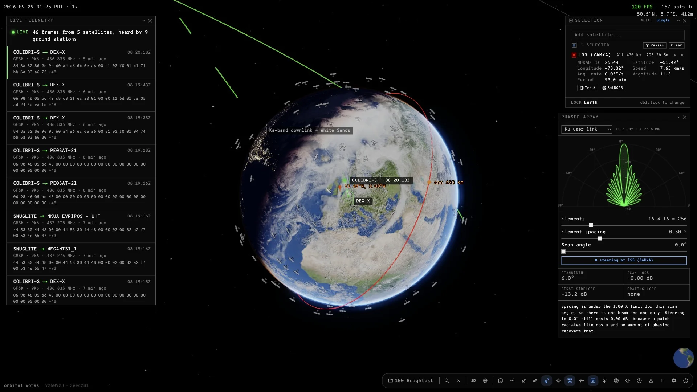
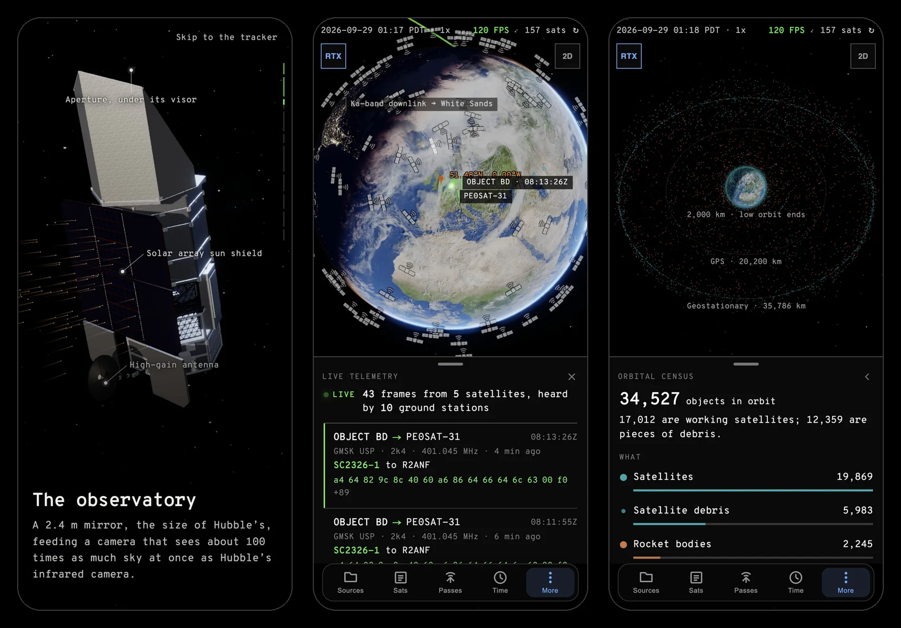
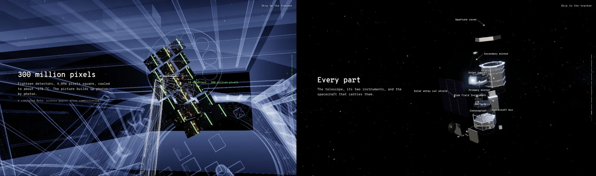
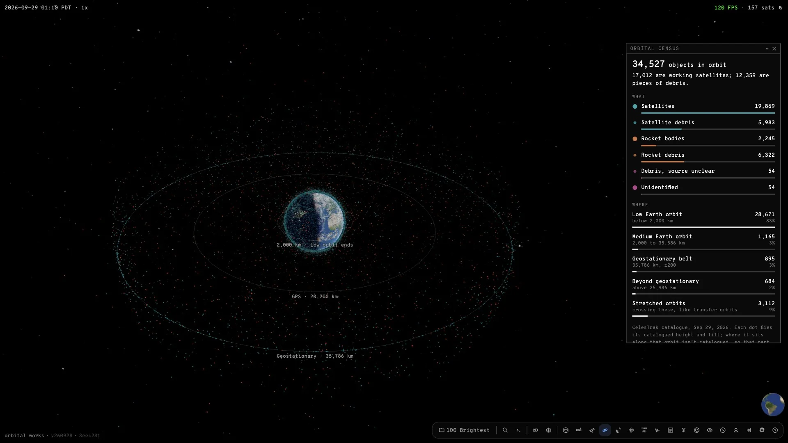

# Orbital Works

A real-time satellite tracker with a spacecraft hardware and RF console bolted
on. Runs in the browser, on desktop and on phones, with no account.

**Live: [orbital-works.vercel.app](https://orbital-works.vercel.app)**



Propagates the public catalogue with SGP4 against live orbital elements,
renders it on a textured Earth, and tells you when things fly over you and how
bright they will be. It streams the frames that volunteer ground stations are
decoding from satellites right now, draws everything humanity has left in
orbit, and opens on NASA's newest space telescope.

<p align="center">
  
</p>

## What's in it

**Roman Space Telescope.** The landing page is a scroll-driven story about
NASA's Nancy Grace Roman Space Telescope, launched 30 August 2026. Scroll and
the camera follows Roman's real trajectory from Earth out past the Moon to its
orbit around L2 (JPL Horizons), arrives at the observatory, unfolds it in the
order and at the times it deployed, sweeps an X-ray through the telescope to
follow starlight down the mirrors, builds an image on the eighteen detectors,
sends it home over the dish to whichever ground station can see Roman right
now, and takes the observatory apart. Scrolling back plays it in reverse, and
reduced-motion settings hold each shot still.



The model is a reconstruction from public sources, not CAD, and says so: every
figure comes from a dimension store that tags it published, derived from
published figures, or estimated. It is built headlessly in Blender from
`scripts/roman/` (`npm run roman:glb`; `npm run roman:test` for the checks),
with a QC pass that measures the built meshes against NASA's published
dimensions and its flight-configuration renders.

**Live telemetry.** Frames that volunteer [SatNOGS](https://network.satnogs.org)
ground stations decoded from satellites in the last half hour, streamed in the
order they were heard: the satellite, the station, mode and frequency, the
AX.25 callsigns, the payload as text where it is text (beacons, housekeeping
CSV), and the raw bytes. The globe draws the station, where the satellite was
at the moment the station heard it, the pass it was heard on, and the downlink
between them. SatNOGS sends no CORS headers, so `api/telemetry.ts` reads the
network once and the edge caches the answer for 90 seconds.

**Orbital census.** Every object CelesTrak's catalogue lists in orbit, about
34,500, one dot each on its catalogued height and tilt, coloured by what it
is: working and dead satellites, rocket bodies, and debris from each. Filter
by type or by orbit and click any dot to name it. `npm run census:data`
refreshes the snapshot.



**Tracking.** 3D globe with clouds, night lights, atmospheric scattering and
terrain elevation. Orbit trails, ground tracks, footprints, apogee/perigee
markers. Sky view for what's above you right now, and an orrery for the
inner solar system.

**Passes.** Pass prediction over your observer position with elevation,
azimuth, duration, visual magnitude and eclipse state — filterable by
elevation, azimuth window, duration, frequency, and a custom horizon mask for
the trees and buildings you actually have.

**Ground station.** Polar plot, Doppler shift curves, SatNOGS transmitter
database, and serial antenna rotator control speaking Yaesu, SPID, GS-232,
EasyComm, Prosistel, RC2800, FLIR and rotctld/rigctld.

**Anatomy.** 15 spacecraft modelled as parts lists over a shared 66-component
library — buses, arrays, Hall thrusters, phased arrays, laser terminals,
brightness mitigation. The 3D model is generated procedurally from the parts
list rather than loaded as a fixed mesh, so the exploded view and the mass and
power budgets all fall out of the same data. Modelled mass is shown against
published mass, so divergence is visible rather than hidden.

**Designer.** Describe a mission in plain language and a model designs a
satellite for it — picking hardware from the 84-component library, inventing
only what the catalogue lacks, and rendering the result through the same
procedural geometry pipeline as the hand-built fleet. It is then graded by the
same mass and power analysis, so the app will tell you when the design does not
close. Click parts in 3D, stow the arrays, and revise it in place ("halve the
mass") without starting over.

**Radio.** A Phased Array window showing array factor, scan loss and the
grating lobes that appear past ~0.5λ element spacing, steerable at whatever
satellite you are tracking. A Waveform window with the Ku downlink's OFDM
spectrum, its time-domain sum, and the constellation the receiver decides on —
4QAM and 16QAM only, because that is all that has ever been observed on air.

**Constellation.** The licensed Starlink shell architecture against what is
actually in your loaded catalogue, matched on inclination and altitude.

**Link budget.** Phased-array and link modelling wired to the live tracking
state. It reads the tracked satellite and your observer position, derives the
real elevation, slant range and off-nadir steering angle, and runs the budget
against that geometry: EIRP, free-space loss, rain fade, co-channel
interference, achievable modulation and rate. Push element spacing past ~0.55λ
and a grating lobe appears.

The Ku user link uses Starlink's actual OFDM waveform — 1024 subcarriers,
750 Hz frames, 4QAM and 16QAM only — not DVB-S2X. Gateway links fall back to
DVB-S2X, labelled as the assumption it is.

Everything lives in draggable, resizable windows on one canvas. `Ctrl+K` opens
the command palette; the dock along the bottom reopens anything you've closed.
Layout persists across reloads. 12 themes, and a theme editor.

## Run it

```bash
npm install
npm run dev      # http://localhost:1420
npm run build
```

No tokens, no registry configuration: a clean checkout builds. `?story=0` in the
URL skips the Roman story and opens the tracker.

Desktop builds via Tauri: `npm run tauri dev`.

## Data

Orbital elements come from [CelesTrak](https://celestrak.org), transmitter data
from [SatNOGS](https://db.satnogs.org). Both are mirrored hourly to
[orbital-works-data](https://github.com/maxmoneycash/orbital-works-data) by
GitHub Actions, so the app reads CORS-friendly static JSON instead of hitting
rate limits, and keeps working when the upstream APIs are throttling. The app
falls back to CelesTrak directly if the mirror is unreachable.

Where SpaceX has published nothing — V3 mass, dimensions, layout — the model
says so rather than inventing a number.

- Band gains, EIRP densities, MODCOD thresholds — SpaceX FCC filings, via
  [NIS-Starlink-Video](https://github.com/noiseinspacechannel/NIS-Starlink-Video) (MIT)
- Waveform, beam counts, ground-cell geometry, brightness magnitudes — the spec
  registry in [BWX-STARLINK](https://github.com/Sleepingknight0/BWX-STARLINK) (MIT),
  tracing to UT Austin's live-signal teardown (IEEE TAES 2023)

## Configuration

| Variable | Effect |
|---|---|
| `VITE_TEXTURE_QUALITY=lite` | Force low-resolution textures (~15× smaller) |
| `VITE_DATA_MIRROR` | Override the data mirror base URL |
| `VITE_CELESTRAK_BASE` | Override the CelesTrak base URL |
| `VITE_FEEDBACK_TOYS=false` | Hide the external-device feedback UI |
| `VITE_SITE_URL` | Absolute origin for `og:` tags |

## Licence and credits

**AGPL-3.0.** This is a network-deployed application, so section 13 applies:
anyone using it over a network is entitled to the complete corresponding
source, which is this repository. [NOTICE](NOTICE) records the work this is
derived from and what was changed.

Live telemetry: frames and pass data from the [SatNOGS Network](https://network.satnogs.org),
decoded by its volunteer ground stations.

Roman facts, photos consulted and deployment timeline: NASA
([roman.gsfc.nasa.gov](https://roman.gsfc.nasa.gov/interactive/),
[science.nasa.gov/mission/roman-space-telescope](https://science.nasa.gov/mission/roman-space-telescope/)),
STScI and NTRS papers cited in `scripts/roman/roman_dims.py`. Not endorsed by NASA.
Overpass Mono (SIL OFL 1.1).

Textures: [NASA SVS CGI Moon Kit](https://svs.gsfc.nasa.gov/4720/),
[Solar System Scope](https://www.solarsystemscope.com/textures/).
